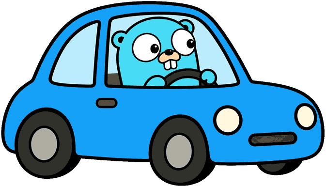
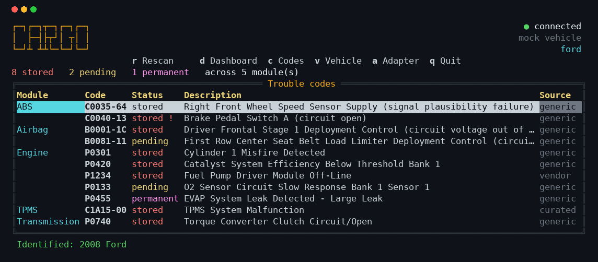

<p align="center">
  
</p>

<h1 align="center">cargo</h1>

<p align="center">
  A command-line OBD-II tool. Reads live data and diagnostic trouble codes
  <br>from a vehicle through an ELM327 adapter.
</p>

<p align="center">
  <a href="https://github.com/fallais/cargo/actions/workflows/ci.yml">
    
  </a>
  <a href="https://github.com/fallais/cargo/releases">
    
  </a>
  <a href="https://pkg.go.dev/github.com/fallais/cargo">
    
  </a>
  <a href="https://goreportcard.com/report/github.com/fallais/cargo">
    
  </a>
  <a href="go.mod">
    
  </a>
  <a href="LICENSE">
    
  </a>
  
  
</p>

## Screenshot

<p align="center">
  
</p>

Codes grouped by the ECU that reported them. The chassis and airbag faults came
over UDS, so they carry a failure type (`C0035-64`) saying how the part failed,
and the `!` marks one whose module is asking for a warning lamp. `P1234` reads
as Ford's definition because the VIN identified the car.

## Usage

```
go install github.com/fallais/cargo@latest

# or from a clone
go build -o cargo .

./cargo                 # terminal UI
./cargo --no-tui        # one-shot report
```

Keys: `d` dashboard, `c` codes, `v` vehicle, `a` adapter, `q` quit.

## Connecting

The UI starts without attaching to anything. The adapter page (`a`) lists the
devices it can see, and `enter` connects to the one you pick, because attaching
to a car is not something to do behind your back.

`t` on that page turns on autoconnect, which attaches to the first adapter that
answers and reattaches if the cable is pulled. `--autoconnect` starts that way.
The one-shot report has no picker, so it always connects on its own.

## Flags

| | |
|---|---|
| `--port` | adapter device (default: scan `ttyUSB*`, `ttyACM*`, `rfcomm*`) |
| `--baud` | serial rate (default: probe 38400, 9600, 115200, 230400, 500000) |
| `--make` | vehicle marque, overriding the selected vehicle for one run |
| `--autoconnect` | attach to the first adapter that answers, without being asked |
| `--theme` | `terminal` keeps your background, `dark` paints its own |
| `--no-tui` | print one report and exit |
| `--debug` | verbose logging |

Any flag can also be set via `CARGO_*` environment variables or
`$XDG_CONFIG_HOME/cargo/cargo.yaml`.

## Trouble codes

Codes are read from every ECU that answers, and reported with the module they
came from and how confirmed they are.

The protocol depends on the module. Emissions controllers answer the OBD-II
modes, giving stored (03), pending (07) and permanent (0A) codes. ABS, airbag,
body and TPMS controllers answer UDS service `0x19` instead, where each code
carries a failure type saying how the component failed, so a fault reads as
`C0035-64` rather than just `C0035`. A `!` beside the status means the module
is asking for a warning lamp.

Descriptions come from an embedded catalog of ~18,000 definitions. A code with
no entry is still described from its own encoding rather than reported as
unknown, and manufacturer codes that several marques define differently ask for
`--make` instead of guessing.

## Vehicle

Around 700 manufacturer codes mean different things on different marques, so
the tool needs to know which car it is attached to. The vehicle page (`3`)
keeps a garage of profiles and applies the selected one to every lookup.

Press `r` and it reads the VIN from the car (mode 09 PID 02), decodes the
manufacturer and model year, and saves the profile. Where the VIN is not
available, which is common before the 2005 model year, press `m` and pick the
make. The choice persists in `$XDG_CONFIG_HOME/cargo/garage.json`.

Rebuild the catalog from the upstream datasets with:

```
./cargo import
```

See [docs/dtc-data.md](docs/dtc-data.md) for the data format and why it is CSV.

## Licence

MIT. See [LICENSE](LICENSE). The bundled trouble-code data comes from
third-party datasets; see [NOTICE](NOTICE).
